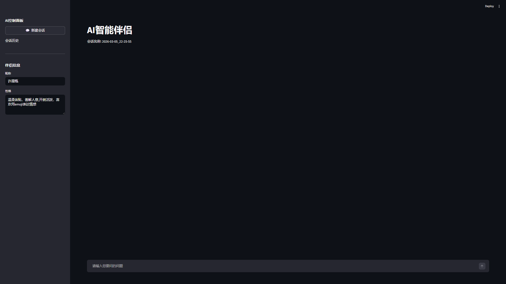

> **声明 / 致谢**：此项目的最初版本是我在学习黑马程序员的网课时，跟着课程一步步敲出来的练习项目。课程链接：<https://www.bilibili.com/video/BV1sHU9BmEne/?vd_source=b7fe282ae22dcad10ba845b5eea36a47>。  
> 本文更多是在此基础上做的**个人复盘与工程化整理**（如 .env、LICENSE、Topics、GitHub Actions、Ruff、README 徽章等），并记录我在同步、配置与 CI 上踩过的坑和解决方式。

---

这篇文章复盘我做 `streamlit-ai-companion` 的过程：前半部分是项目实现（Streamlit + DeepSeek API），后半部分是把仓库“工程化”的学习经历（.env、License、Topics、GitHub Actions、Ruff、README 徽章）。整体不是教程流水账，而是按“我遇到的问题 → 为什么 → 怎么解决”的方式写。

## 1. 项目简介：我做了什么

我做了一个基于 **Streamlit** 的 AI 智能伴侣聊天应用：

- 聊天 UI：`st.chat_input` + `st.chat_message`
- 可配置“伴侣信息”：昵称 + 性格（sidebar 动态修改）
- 流式输出：模型一边生成一边显示，聊天更自然
- 会话历史：保存为本地 JSON 文件，支持加载/删除


## 2. 为什么要做工程化（而不是只停留在能跑）

一开始我的项目确实能运行，但“能跑”和“可维护/可分享”是两回事：

- 需要别人一眼看懂怎么运行（README）
- 不能把 API Key 提交上去（.env 处理）
- 需要许可证声明（LICENSE）
- 最好能有自动检查（CI），避免以后改坏了都不知道

所以我给仓库补齐了这些“标配”。

## 3. 项目核心实现复盘（结合 AI_companion.py）

### 3.1 关键配置：模型、Base URL、环境变量

我把关键参数集中在文件顶部：

- `DEEPSEEK_API_KEY`：用环境变量读取 Key
- `BASE_URL = "https://api.deepseek.com"`
- `MODEL_NAME = "deepseek-chat"`
- `SESSIONS_DIR = "sessions"`

这样做的好处是：以后换模型/换环境变量名时不会到处改。

另外，我还加了一个“友好提示”：

- 如果没有检测到 `DEEPSEEK_API_KEY`，页面会 `warning`
- 但不会直接崩掉，便于我先调 UI

### 3.2 会话历史：为什么用 JSON 文件而不是上数据库

我选择每个会话一个文件：

- 会话名用时间戳生成：`YYYY-MM-DD_HH-MM-SS`
- 会话文件：`sessions/<session>.json`
- 存储内容：`nick_name` / `nature` / `messages` / `current_session`

优点是非常直接：不需要数据库，文件可读、可备份，适合这个阶段的小项目。

### 3.3 Prompt：如何让它“像伴侣”而不是普通客服

我在 system prompt 里写了清晰规则，例如：

- 每次只回 1 条消息
- 禁止状态/场景描述
- 回复短一点，像微信聊天
- 必须体现“伴侣性格”

同时把昵称/性格注入进去，让侧边栏输入立刻影响模型输出。

### 3.4 流式输出：为什么聊天体验明显更好

我用 `stream=True` 接收增量内容（delta），然后不断把文本拼起来更新页面。  
好处是：模型生成时用户不会“干等”，体验更像真实聊天。

## 4. Git 同步踩坑：为什么 push 会被拒绝（non-fast-forward）

第一次整理仓库时就遇到过 `git push` 被拒绝。

原因其实很典型：**远端 main 比我本地多一个提交**，为了避免覆盖远端历史，Git 要求我先同步。

最后形成的操作习惯是：

1. 本地改动先 `git add` + `git commit`
2. `git pull origin main` 把远端更新合到本地
3. 再 `git push`

中间如果弹出 Vim 让我写 merge message，用 `:wq` 保存退出。

## 5. 安全：`.env.example` + `.gitignore`

如果项目要用 API Key，最容易踩的坑就是“把 key 不小心提交到了 GitHub”。

我的做法：

- 提交 `.env.example`：只放变量名和示例值
- `.gitignore` 忽略 `.env`：真实 key 放本地 `.env`，永远不提交

`.env.example` 大概是这样：

```dotenv
DEEPSEEK_API_KEY=your_api_key_here
```

## 6. GitHub Actions：为什么加 CI，以及 YAML 为什么会失败

我给仓库加了最小 CI（push/PR 自动跑检查），核心就是跑 Ruff：

- 安装依赖
- 安装 ruff
- `ruff check .`

我踩的最大坑在于：workflow 的 YAML 必须是严格的英文关键字和英文标点。  
我当时出现过：

- 把 `on:` 写成了中文的 `于:`
- 把逗号写成了中文 `，`

结果 Actions 报：`Invalid workflow file`（解析 YAML 失败）。

这件事让我意识到：CI 不是玄学，很多失败就是“配置文件一处字符不对”。 其实是GitHub中文化插件害的 :(

## 7. Ruff 是什么？为什么我 CI 又红了😡（I001）

Ruff 是一个速度很快的 Python linter（代码检查工具）：

- 能找出潜在错误（比如未使用变量、明显 bug）
- 能做代码风格检查
- 其中一部分问题还能自动修复（`--fix`）

我加了 `pyproject.toml` 之后启用了 import 排序规则（`I`），然后 CI 报错：

- `I001 import block is un-sorted or un-formatted`

这并不是“项目坏了”，而是告诉我：**import 顺序不规范**。

我在本地修复的方式是：

```bash
python -m pip install ruff
python -m ruff check . --fix
```

修完提交后，CI 就会重新变绿。

## 8. README 徽章：小改动但很提升“第一印象”

我给 README 顶部加了两个徽章：

- CI Badge：一眼看出是否通过
- MIT License Badge：许可证信息清晰

这类小细节对个人项目也很有帮助：别人点进仓库更容易产生信任感。

## 9. 这次真正学到的

如果用一句话总结：不仅写了一个 Streamlit 应用，还把它变成了一个更像“能被别人使用/能长期维护”的仓库。

- 理解为什么会 non-fast-forward，以及同步的正确节奏
- 学会用 `.env.example` 避免密钥泄露
- 学了配一个最小 CI
- 第一次用 Ruff 让 CI 报红、再用工具自动修复，让它重新变绿

---

## 项目地址

---

## 项目地址

- GitHub 仓库：<https://github.com/W1shBottle/streamlit-ai-companion>

## 运行方式（本地）

> 需要：Python 3.10+（建议 3.10/3.11）

### 1) 克隆项目

```bash
git clone https://github.com/W1shBottle/streamlit-ai-companion.git
cd streamlit-ai-companion
```

### 2) 创建并激活虚拟环境（推荐）

**Windows (PowerShell)**

```powershell
py -m venv .venv
.\.venv\Scripts\Activate.ps1
```

**macOS / Linux**

```bash
python3 -m venv .venv
source .venv/bin/activate
```

### 3) 安装依赖

```bash
pip install -r requirements.txt
```

### 4) 配置环境变量（DEEPSEEK_API_KEY）

你可以用 `.env`（推荐）或直接导出环境变量。

**方式 A：创建 `.env` 文件（推荐）**
在项目根目录新建 `.env`：

```env
DEEPSEEK_API_KEY=你的key
```

**方式 B：直接设置环境变量**
Windows (PowerShell)：

```powershell
$env:DEEPSEEK_API_KEY="你的key"
```

macOS / Linux：

```bash
export DEEPSEEK_API_KEY="你的key"
```

### 5) 启动

```bash
streamlit run AI_companion.py
```
