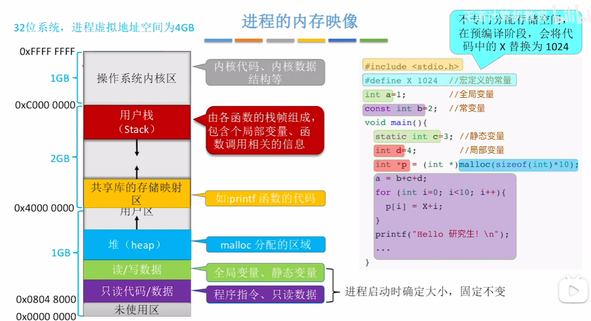
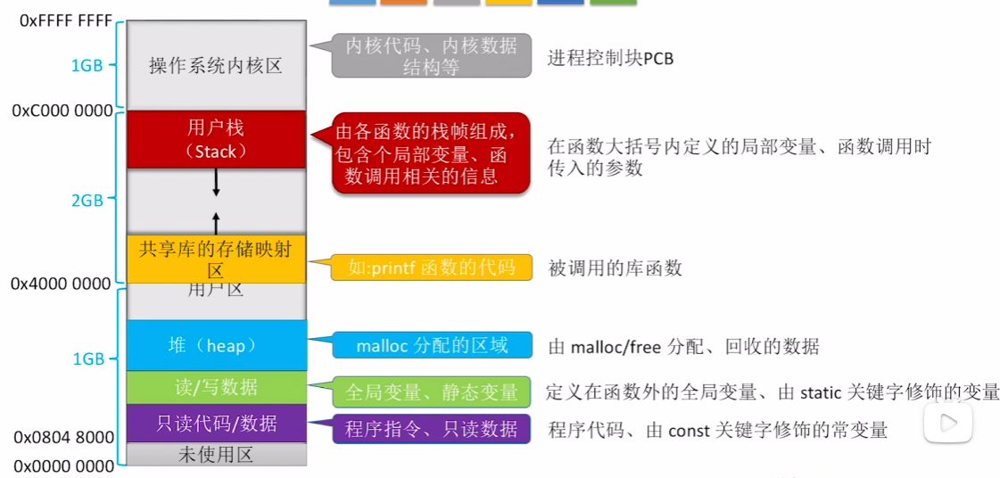
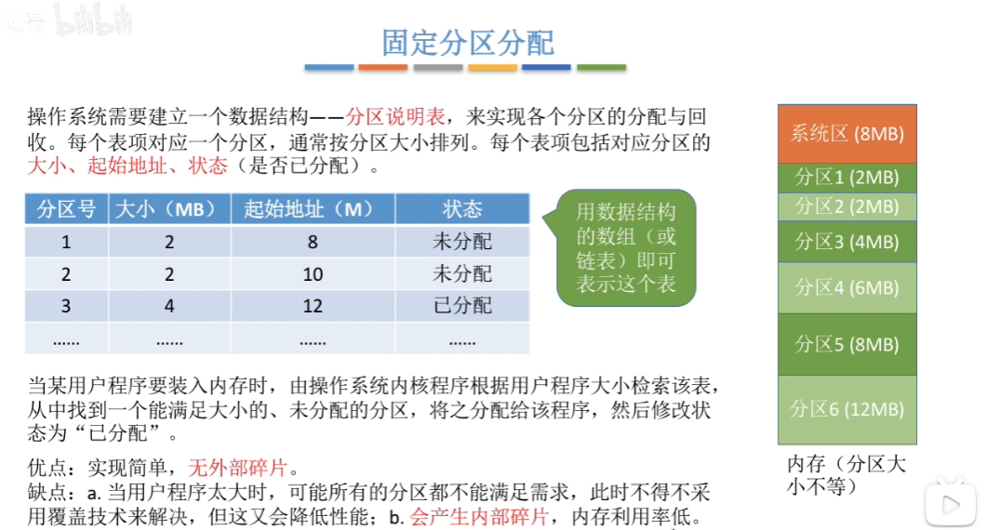
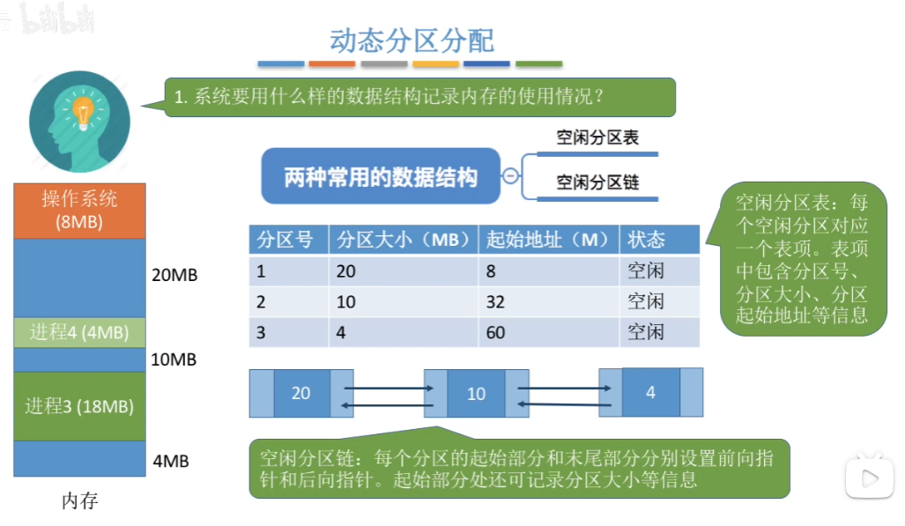

> 说明：本文为个人学习笔记，内容参考王道《操作系统》网课与配套讲义，按个人理解整理总结，仅用于学习交流，如有疏漏欢迎指正。

## 摘要

本文梳理操作系统内存管理中的几个核心概念：内存的作用、地址转换（装入与重定位）、链接方式、内存保护与连续分配策略，并对常见动态分区分配算法进行对比，理解碎片与紧凑的必要性。

---
## 内存的作用

程序在执行前需要先装入内存，CPU 才能对其进行处理。内存的核心作用之一是**缓和 CPU 与硬盘之间的速度矛盾**：

- 硬盘/外存先把即将使用的数据读取到内存；
- CPU 需要数据时直接访问内存，而不必反复访问硬盘；
- 从而显著提升整体执行效率。

---

## 地址转换（装入与重定位）

### 1）绝对装入（Absolute Loading）

**特点：**
- 程序装入内存之前就确定装入位置，在编译阶段就把逻辑地址直接转换为最终物理地址。

**前提：**
- 必须提前知道装入模块从哪个物理地址开始装入。

**缺点：**
- 灵活性极差：装入位置变化会导致地址全部失效。

---

### 2）静态重定位（Static Relocation）

**特点：**重定位过程在**装入时**完成。

例：若装入起始物理地址为 `100`，则所有与地址相关的值统一加上 `100`。

**限制：**
- 作业装入内存时一次性分配其所需全部空间；
- **运行期间不可移动**（无法在内存中动态搬迁）。

---

### 3）动态重定位（Dynamic Relocation，现代 OS 常用）

**特点：**
- 编译/链接阶段仍使用**逻辑地址**；
- 装入内存后**不立即**把逻辑地址改写成物理地址；
- 运行时由硬件机制完成转换。

**关键硬件支持：**
- **重定位寄存器（Relocation Register）**：存放装入模块的起始物理地址（基址）。

**地址转换：**
- CPU 执行时：`物理地址 = 逻辑地址 + 重定位寄存器(基址)`

**优势：**
- 允许程序在内存中发生移动（更灵活，也更利于多道程序和内存紧凑）。

---

## 从写程序到程序运行（以 C 语言为例）

1. 编写源代码：生成 `*.c`
2. 编译：生成目标模块 `*.o`
3. 链接：把多个目标模块 + 库函数链接成装入模块（可执行文件）`*.exe`
4. 装入：把装入模块装入内存，此时确定其对应的实际物理地址范围

---

## 链接方式

### 1）静态链接

**在运行前**，把各目标模块及其所需库函数连接成一个完整可执行文件，之后不再拆分。

### 2）装入时动态链接

边装入边链接：装入模块进内存时再完成链接。

### 3）运行时动态链接

程序执行过程中，**需要某个目标模块时才链接**。

**优点：**
- 便于修改、更新；
- 便于实现对目标模块的共享（多个进程可共享同一模块）。

---

## 内存保护

### 1）设置上下限寄存器（Limit Registers）

- 上下限寄存器存放进程的地址范围（通常是物理地址上下界）。
- 进程访问某地址时，CPU 检查是否越界，越界则触发异常。

### 2）重定位寄存器 + 界地址寄存器

- **重定位寄存器（基址）**：起始物理地址
- **界地址寄存器（界限/长度）**：进程最大逻辑地址（或逻辑地址范围大小）

检查逻辑地址是否小于 ` 界地址`，通过后再做 `逻辑地址 + 基址` 得到物理地址。

---

## 进程的内存映像

---

## 连续分配管理方式（Contiguous Allocation）

系统为用户进程分配的必须是**一段连续的内存空间**。

### 1）单一连续分配

内存分为：
- 系统区
- 用户区（只能装入一道用户程序，独占整个用户区）

**优点：**
- 实现简单
- 无外部碎片

**缺点：**
- 有内部碎片
- 存储器利用率极低

---

### 2）固定分区分配（Fixed Partitioning）

将用户空间划分为若干固定大小的分区，每个分区只装入一道作业。

#### 分区大小相等
- 缺乏灵活性
- 适用于多个相同对象/任务规模相近的场景

#### 分区大小不等
- 灵活性更高
- 可减少内部碎片（相对于“大小完全一致”）

---

### 3）分区说明表

用于记录各分区的分配与回收。每个表项对应一个分区，通常按分区大小排列，包含：

- 分区大小
- 起始地址
- 状态（是否已分配）

---

### 4）动态分区分配（Dynamic Partitioning）

进程装入内存时根据进程大小**动态建立分区**，分区大小尽量与进程需求匹配。

#### 系统用什么数据结构记录内存使用情况？

- **空闲分区表**
- **空闲分区链**

---

#### 分区的分配与回收

##### 分配
- 从较大的空闲分区切出一部分分配给进程：更新空闲分区的**起始地址与大小**
- 若空闲分区恰好完全分配给进程：删除该空闲表项（或从链表摘除）

##### 回收（合并相邻空闲区）
- 回收区后面有相邻空闲分区：二者合并
- 回收区前面有相邻空闲分区：二者合并
- 前后都有相邻空闲分区：三者合并
- 前后都没有相邻空闲分区：新增一个空闲分区表项

---

#### 碎片问题

动态分区分配：
- **没有内部碎片**
- **但存在外部碎片**

概念区分：
- **内部碎片**：分配给进程的分区内部未被利用的空间
- **外部碎片**：内存中多个过小、分散、难以利用的空闲分区

##### 紧凑（Compaction）

当空闲空间总和足够，但分散成碎片而无法提供**一整块连续空间**时，可以：

- 将已分配的进程向一侧移动
- 把分散的空闲空间“拼接”为一段连续大空闲区

---

## 动态分区分配算法

### 1）首次适应算法（First-Fit）

**思想：**
- 每次从低地址开始查找，找到第一个满足大小的空闲分区就分配

**实现：**
- 空闲分区按地址递增排列
- 分配时顺序查表/链寻找第一个可用分区

---

### 2）最佳适应算法（Best-Fit）

**思想：**
- 优先使用更小、但能满足需求的空闲区（尽量“刚好合适”）

**实现：**
- 空闲分区按容量递增排列
- 顺序查找第一个满足要求的分区

**缺点：**
- 容易留下大量很小、难以利用的碎片（外部碎片较多）

---

### 3）最坏适应算法（Worst-Fit）

**思想：**
- 优先使用最大的空闲区（避免留下太大的“不可控”空洞）

**实现：**
- 空闲分区按容量递减排列
- 顺序查找第一个满足要求的分区

**缺点：**
- 大空闲区很快被切碎
- 后续大进程到来可能无足够连续空间可用

---

### 4）临近适应算法（Next-Fit）

**思想：**
- 从上次查找结束位置继续查找（不是每次都从链头开始）

**实现：**
- 空闲分区按地址递增排列，可组织成循环链表
- 每次从“上次结束位置”继续检索，找到第一个满足要求的分区

**缺点：**
- 高地址大分区更容易被频繁切割成小分区
- 最终可能出现无足够大的连续分区（与最坏适应的某些问题相似）

---

## 四种动态分区算法

---

## 全文小结

本文主要梳理内存的作用、地址转换（绝对装入/静态重定位/动态重定位）、程序从编译链接到装入运行的流程，以及静态/动态链接方式与基本内存保护机制。最后总结连续分配管理（单一连续、固定分区、动态分区）及首次/最佳/最坏/临近适应算法，并说明外部碎片与紧凑的关系。

