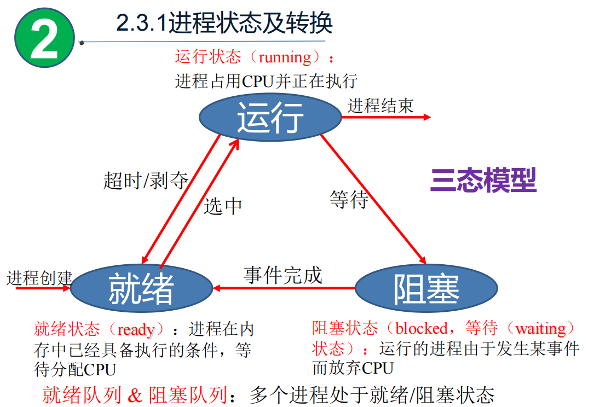
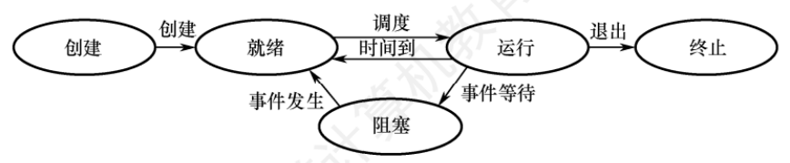

> 说明：本文为个人学习笔记，内容参考王道《操作系统》网课与配套讲义，按个人理解整理总结，仅用于学习交流，如有疏漏欢迎指正。

## 摘要

本文梳理操作系统中**进程**的核心知识：进程的概念与特征、PCB 与组成结构、三态/五态模型、进程控制原语（创建、终止、阻塞与唤醒）以及进程通信方式（共享存储、消息传递、管道）。

---

## 1. 进程的概念和特征

### 1.1 概念（常见表述）

进程的典型定义：

1. 进程是一个正在执行程序的实例。
2. 进程是程序及其数据从磁盘加载到内存后，在 CPU 上执行的过程。
3. 进程是一个具有独立功能的程序在一个数据集合上运行的过程。

### 1.2 特征（四个基本特征）

- **动态性**：有产生、运行、消亡的过程。
- **并发性**：多个进程在一段时间内并发推进。
- **独立性**：进程是资源分配与调度的基本单位。
- **异步性**：推进速度不可预知，需要同步机制保证正确性。

---

## 2. 进程的组成

进程由三部分组成，其中最核心是 **PCB（进程控制块）**：

- **PCB（Process Control Block）**
- **程序段**
- **数据段**

> 记忆点：**PCB 是进程存在与管理的关键依据**。

---

## 3. 进程的状态与转换

五种状态（前三种为基本状态）：

- **运行态（Running）**：占用 CPU，正在执行。
- **就绪态（Ready）**：具备运行条件，仅缺 CPU，等待调度。
- **阻塞态（Blocked/Waiting）**：等待事件/资源（除 CPU 外），暂停推进。
- **创建态（New）**：正在创建，尚未进入就绪队列。
- **终止态（Terminated）**：正在结束并从系统消失。

### 就绪态 vs 阻塞态

- **就绪态**：只缺 **CPU**。
- **阻塞态**：缺 **事件/资源**（I/O、信号、锁、数据等）。

### 3.1 三态模型

### 3.2 五态模型

---

## 4. 进程控制（原语）

操作系统中，进程控制常通过**原语**实现。

原语特点：

- **执行期间不可中断**（原子性）
- 通常在**内核态**完成
- 保证进程控制操作一致、正确

---

### 4.1 进程的创建（Create）

父子进程关系：

- 创建者为**父进程**，被创建者为**子进程**
- 子进程可继承父进程部分资源；结束时资源归还父进程/系统

创建原语典型步骤：

1. 分配 **PID**，申请空白 **PCB**（PCB 有限，失败则创建失败）。
2. 分配资源（内存、文件、I/O 设备、CPU 时间等）。
3. 初始化 PCB（标志信息、CPU 状态等），设置优先级等调度信息。
4. 插入**就绪队列**，等待调度运行。

---

### 4.2 进程的终止（Exit / Terminate）

终止原因：

- **正常结束**
- **异常结束**（越界、保护错、非法指令、特权指令错、超时、算术溢出、I/O 故障等）
- **外界干预**（用户/OS/其他进程请求结束）

终止原语典型步骤：

1. 检索 PCB，读取状态。
2. 若处于运行态，终止执行并释放 CPU。
3. 若有子进程，通常先终止所有子进程（依系统策略）。
4. 回收资源（归还父进程或 OS）。
5. PCB 出队并释放。

---

### 4.3 进程的阻塞与唤醒（Block/Wakeup）

#### 阻塞（Block）

触发：等待事件/资源（I/O 完成、数据到达、资源可用等）

流程：

1. 找到进程 PCB。
2. 若为运行态：保存现场，置为阻塞态，停止运行。
3. 进入对应事件的等待队列，CPU 让给其他就绪进程。

#### 唤醒（Wakeup）

触发：等待事件发生（I/O 完成、资源可用等）

流程：

1. 在等待队列中找到目标 PCB。
2. 移出等待队列，置为就绪态。
3. 插入就绪队列，等待调度。

#### 配对关系

- **Block 与 Wakeup 必须成对使用**：只阻塞不唤醒会导致进程长期等待（死等/永久阻塞）。

---

## 5. 进程通信

- **低级通信**：以 **PV 操作** 等为代表（更偏同步互斥与简单控制）。
- **高级通信**：高效传输大量数据，主要三类：
  1. **共享存储**
  2. **消息传递**
  3. **管道通信**

---

## 6. 小结

- 进程的核心：**PCB**。
- 状态区分关键：就绪只缺 CPU；阻塞缺事件/资源。
- 进程控制靠原语：创建 / 终止 / 阻塞 / 唤醒（Block/Wakeup 配对）。
- 通信三类：共享存储 / 消息传递 / 管道通信。

